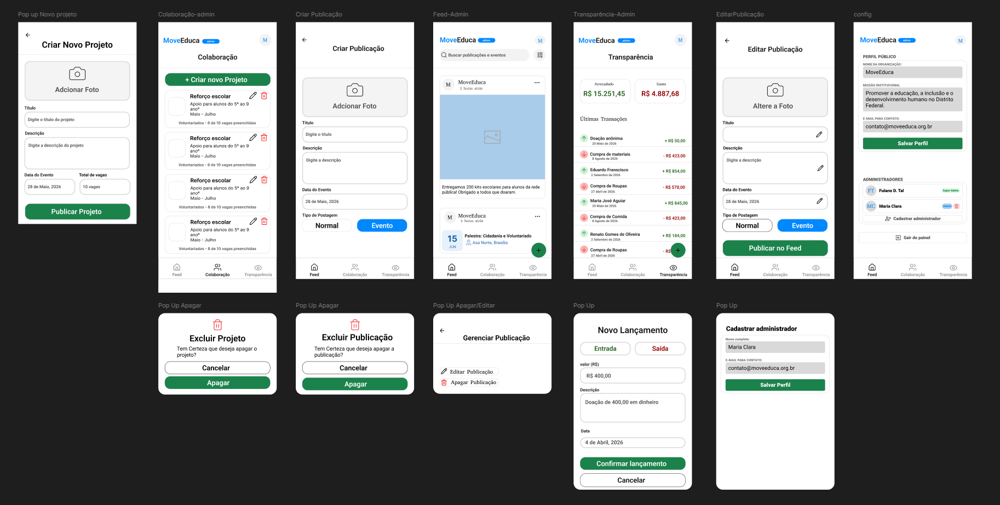

# Evidências — Sprint 1

---

## User Stories

!!! abstract "Sprint de planejamento e prototipagem"
    Nesta sprint não houve implementação de User Stories funcionais. O foco foi a construção do ambiente de desenvolvimento, elaboração do protótipo de baixa fidelidade no Figma e construção do User Story Map (USM), estabelecendo a base para as sprints de desenvolvimento.

---

## Engenharia de Requisitos

### Evidências do Processo de ER

> Atividades de Engenharia de Requisitos realizadas nesta sprint, conforme o processo ScrumXP definido em [Engenharia de Requisitos](../visao_produto/5-EngenhariadeRequisitos.md).

#### Elicitação e Descoberta

- Entrevistas com o cliente para levantamento das necessidades reais das ONGs — contexto de domínio e requisitos iniciais coletados e registrados na [Ata 1](../atas/ata1_27_04_2026.md).
- Brainstorming interno de arquitetura e produto: definição da stack tecnológica inicial e dos módulos principais do sistema (feed, transparência, colaboração).

#### Análise e Consenso

- Priorização Valor x Esforço aplicada em conjunto com a cliente para definição do escopo do MVP — aprovação do User Story Map na reunião de 27/04 ([Ata 1](../atas/ata1_27_04_2026.md)).

#### Declaração de Requisitos

- US01–US22 escritas, refinadas e formalizadas no [User Story Map](../visao_produto/10-story_map.md) com personas, objetivos e critérios de aceite.

#### Representação de Requisitos

- [User Story Map](../visao_produto/10-story_map.md) construído como representação visual e estruturada do escopo completo do produto, organizando as histórias por jornada do usuário e prioridade de entrega.
- Protótipo de baixa fidelidade desenvolvido no Figma (ver seção abaixo) representando os fluxos das três abas principais — validado com a cliente antes do início do desenvolvimento.

#### Validação de Requisitos — Protótipos e Feedback do Cliente

- Protótipo de baixa fidelidade e USM apresentados ao cliente (Paulo) por Letícia na reunião de 27/04.
- USM validado e aprovado: *"deu a aprovação oficial para seguirmos"* — [Ata de Validação S1](../atas/ata_validacao_s1_27_04_2026.md).
- Encaminhamentos e ajustes de escopo incorporados ao planejamento da Sprint 2.

---

### Reuniões e Cerimônias Realizadas

#### Sprint Planning

> Reunião de definição do escopo, estimativas e comprometimento do time para a sprint.

📄 _Caso a visualização abaixo não funcione, [acesse a ata diretamente](../atas/ata_planejamento_s1_14_04_2026.md)._

!!! success "Sprint Planning Sprint 1 — 14/04/2026 · Presencial · Campus FGA"

    --8<-- "atas/ata_planejamento_s1_14_04_2026.md"

#### Refinamento do User Story Map

> Reunião interna realizada na semana intermediária da sprint para revisão e detalhamento das histórias do User Story Map.

📄 _Caso a visualização abaixo não funcione, [acesse a ata diretamente](../atas/ata_refinamento_s1_21_04_2026.md)._

!!! info "Refinamento do User Story Map — 21/04/2026 · Discord"

    --8<-- "atas/ata_refinamento_s1_21_04_2026.md"

#### Validação com o Cliente

> Reunião de apresentação do incremento da sprint ao cliente para coleta de feedback e aprovação formal. Participantes: Letícia Vitória (equipe) e Paulo (stakeholder).

📄 _Caso a visualização abaixo não funcione, [acesse a ata diretamente](../atas/ata_validacao_s1_27_04_2026.md)._

!!! success "Aprovação do USM e Protótipo — 27/04/2026 · Discord · Letícia e Paulo"

    --8<-- "atas/ata_validacao_s1_27_04_2026.md"

#### Retrospectiva da Equipe

> Percepções individuais dos membros sobre a sprint e aprendizados coletivos.

📄 _Caso a visualização abaixo não funcione, [acesse a ata diretamente](../atas/ata_retrospectiva_s1_27_04_2026.md)._

!!! info "Retrospectiva Sprint 1 — 27/04/2026 · Discord"

    --8<-- "atas/ata_retrospectiva_s1_27_04_2026.md"

---

## Engenharia de Software

### Descrição da Entrega

Nesta sprint, o grupo se propôs a estruturar a base do projeto DoaNet e a validar a direção do produto junto ao cliente. Conforme definido no planejamento, uma das principais entregas desta sprint foi a **construção e validação do protótipo de baixa fidelidade** com o cliente, garantindo alinhamento sobre as funcionalidades e a interface antes do início do desenvolvimento. Além disso, foram realizadas a definição da arquitetura do sistema, o mapeamento dos requisitos iniciais e a elaboração do User Story Map (USM).

---

### Protótipo de Alta Fidelidade

> Protótipo interativo desenvolvido no Figma e validado com o cliente durante esta sprint.

<iframe
  style="border: 1px solid rgba(0,0,0,0.1); border-radius: 4px;"
  width="100%"
  height="650"
  src="https://www.figma.com/embed?embed_host=share&url=https%3A%2F%2Fwww.figma.com%2Fproto%2FoWLaaxEIGdP92BsHEt3xAt%2FDoaNet---Prot%25C3%25B3tipo-baixa-fidelidade--c%25C3%25B3pia-%3Fnode-id%3D284-23%26p%3Df%26t%3DCZMpoXMKlitpFLKD-1%26scaling%3Dscale-down%26content-scaling%3Dfixed%26page-id%3D0%253A1%26starting-point-node-id%3D284%253A23%26show-proto-sidebar%3D1"
  allowfullscreen>
</iframe>

---

### Demonstração em Vídeo

    <video controls style="width: 100%; display: block;">
        <source src="assets/evidencia.mp4" type="video/mp4">
        Seu navegador não suporta a reprodução de vídeos.
        <a href="assets/evidencia.mp4">Clique aqui para baixar o vídeo</a>.
    </video>

