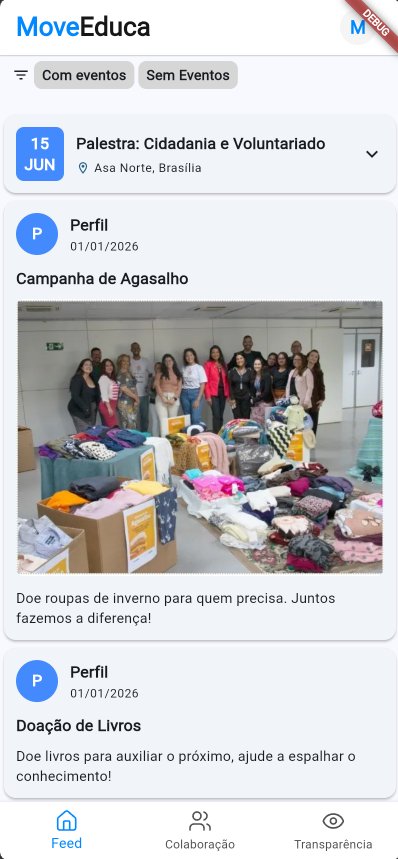
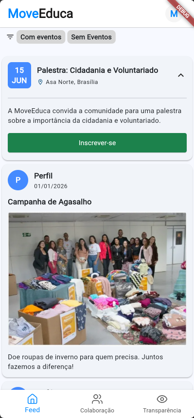
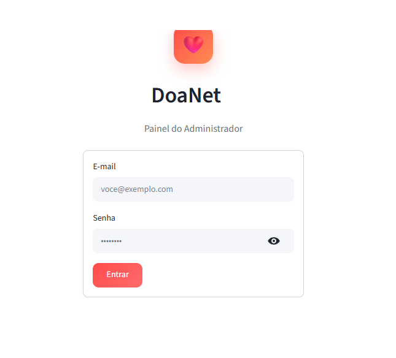
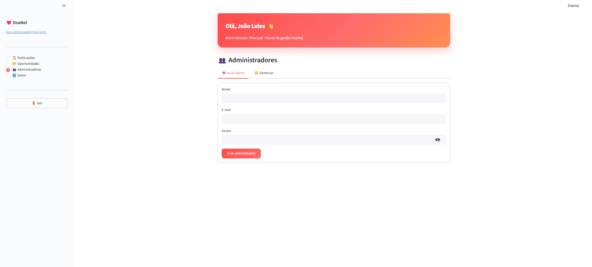

# Evidências — Sprint 3

## User Stories Concluídas

| US | Descrição |
| :--- | :--- |
| **US17** | Como administrador da organização, quero criar uma nova publicação no feed (evento), para me comunicar com os apoiadores. |
| **US09** | Como usuário, quero me inscrever para atender a um evento divulgado, para confirmar minha presença e participação. |
| **US11** | Como administrador, quero me autenticar na plataforma, para acessar o painel de gestão correspondente ao meu nível hierárquico. |

---

## Descrição da Entrega

Nesta sprint, o grupo se propôs a implementar posts de eventos com inscrição, adicionar imagens em todos os tipos de post e iniciar o módulo de admin. O objetivo foi refinar os posts comuns, adicionar os eventos e as opções de administrador.

---

## DoR e DoD

### Definition of Ready — DoR

> Critérios verificados **antes** do início da sprint para garantir que as histórias estavam prontas para desenvolvimento.

| Critério | Status | Evidência |
| :--- | :---: | :--- |
| O requisito possui informação necessária para ser trabalhado? | ✅ | US09, US11 e US17 (extensão para eventos) detalhadas no Story Map com comportamentos de inscrição e autenticação definidos |
| O requisito cabe em uma Sprint? | ✅ | 3 USs concluídas dentro das 2 semanas; encaminhamentos definidos na Ata 4 |
| O requisito está representado por uma história de usuário? | ✅ | US09, US11 e US17 formalizadas no Story Map |
| O requisito está mapeado para uma interface (quando necessário)? | ✅ | Protótipo final apresentado e validado com o cliente na reunião de 26/05 (Ata 5) |
| As definições de arquitetura e contratos de API estão claras? | ✅ | Endpoints de eventos e módulo de autenticação Streamlit definidos com base na arquitetura da Sprint 2 |

### Definition of Done — DoD

> Critérios verificados **ao final** da sprint para confirmar a qualidade e completude das entregas.

| Critério | Status | Evidência |
| :--- | :---: | :--- |
| Entrega um incremento do produto? | ✅ | Feed completo com eventos e inscrição; início do módulo admin entregues |
| Contempla os critérios de aceite estabelecidos? | ✅ | Cliente validou e aprovou o feed completo e o módulo admin na reunião de 26/05 (Ata 5) |
| Está documentado para uso? | _a preencher_ | _Descrever atualização do Swagger/OpenAPI e comentários relevantes no código_ |
| Está aderente aos padrões de codificação? | ✅ | Desenvolvido em FastAPI (back-end), Flutter (front-end) e Streamlit (admin) |
| Mantém os índices de performance do produto? | _a preencher_ | _Descrever métricas ou testes de performance realizados_ |
| O desenvolvimento foi concluído integralmente? | ✅ | CRUD de eventos, inscrição em eventos e autenticação admin funcionando de ponta a ponta |
| O isolamento de dados e segurança foram validados? | _a preencher_ | _Descrever validação da partition key e isolamento multi-tenant_ |
| A conformidade legal e imutabilidade financeira foram aplicadas? | N/A | Não se aplica — sprint sem funcionalidades de pagamento ou doação |
| Os testes foram executados e aprovados? | _a preencher_ | _Descrever testes unitários e de integração realizados_ |
| A funcionalidade foi revisada pela equipe? | _a preencher_ | _Registrar número ou link do Pull Request no GitHub_ |
| A documentação e o feedback relevante foram incorporados? | ✅ | Protótipo final alinhado com equipe e validado pelo cliente; feedback da Ata 5 incorporado |

---

## Evidências do Processo de ER

> Atividades de Engenharia de Requisitos realizadas nesta sprint, conforme o processo ScrumXP definido em [Engenharia de Requisitos](../visao_produto/5-EngenhariadeRequisitos.md).

#### Verificação de Requisitos — Critérios INVEST

Aplicado no Sprint Planning para confirmar que as histórias estavam prontas para desenvolvimento antes de entrar na sprint.

| User Story | I | N | V | E | S | T |
| :--- | :---: | :---: | :---: | :---: | :---: | :---: |
| **US17** — Criar publicação no feed (evento) | ✅ | ✅ | ✅ | ✅ | ✅ | ✅ |
| **US09** — Inscrever-se em evento divulgado | ✅ | ✅ | ✅ | ✅ | ✅ | ✅ |
| **US11** — Autenticar-se como administrador | ✅ | ✅ | ✅ | ✅ | ✅ | ✅ |

> **I** — Independente · **N** — Negociável · **V** — Valiosa · **E** — Estimável · **S** — Suficientemente pequena · **T** — Testável

#### Critérios de Aceite — Evidências de Cumprimento

Critérios verificados na revisão da sprint e validados com o cliente na [Ata 5](../atas/ata5_26_05_2026.md). Definição completa em [10.3 Critérios de Aceite](../visao_produto/10-story_map.md).

**US17 — Criar publicação no feed (evento)**

- ✅ Administrador cria publicação de evento com título, texto, data e imagem opcional
- ✅ Evento exibido imediatamente no feed após criação
- ✅ Criação restrita a administradores autenticados

**US09 — Inscrever-se em evento**

- ✅ Usuário consegue se inscrever em evento a partir da publicação no feed
- ✅ Inscrição registrada e visível para o administrador no painel
- ✅ Confirmação visual exibida ao usuário após inscrição bem-sucedida

**US11 — Autenticar administradores**

- ✅ Administrador faz login com credenciais válidas (e-mail + senha)
- ✅ Credenciais inválidas retornam mensagem de erro sem expor detalhes técnicos
- ✅ Painel exibe apenas as funcionalidades do nível hierárquico do admin autenticado
- ✅ Sessão encerrada corretamente após logout

#### Validação de Requisitos — Protótipos e Feedback do Cliente

- Feed completo (posts normais + eventos com inscrição), suporte a imagens e módulo de autenticação admin demonstrados ao cliente (Paulo) por Letícia na reunião de 26/05.
- Protótipo final apresentado e aprovado pelo cliente como referência para o módulo de admin — ver [Ata de Validação S3](../atas/ata5_26_05_2026.md).
- Encaminhamentos para Sprint 4 (módulo de voluntariado) definidos com base no feedback registrado na ata.

#### Organização e Atualização — Refinamento do User Story Map

- Backlog atualizado com os encaminhamentos da revisão da Sprint 2 ([Ata 4](../atas/ata4_12_05_2026.md)) como insumo para o planejamento desta sprint.

---

## Demonstração em Imagens

---

## Reuniões e Cerimônias Realizadas

### Sprint Planning

> Reunião de definição do escopo, estimativas e comprometimento do time para a sprint.

!!! note "Não registrado separadamente nesta sprint."
    O planejamento da Sprint 3 foi definido pelos encaminhamentos da Revisão da Sprint 2 (Ata 4).

---

### Refinamento do User Story Map

> Reunião interna realizada na semana intermediária da sprint para revisão e detalhamento das histórias do User Story Map.

!!! info "Refinamento do User Story Map — 19/05/2026 · Discord"

    --8<-- "atas/ata_refinamento_s3_19_05_2026.md"

---

### Validação com o Cliente

> Reunião de apresentação do incremento da sprint ao cliente para coleta de feedback e aprovação formal. Participantes: Letícia Vitória (equipe) e Paulo (stakeholder).

!!! success "Aprovação do Feed Completo, Eventos e Admin — 26/05/2026 · Discord · Letícia e Paulo"

    --8<-- "atas/ata5_26_05_2026.md"

---

### Retrospectiva da Equipe

> Percepções individuais dos membros sobre a sprint e aprendizados coletivos.

**Data:** _a preencher_  
**Participantes:** Davi Ursulino, João Leles, Letícia Vitória, Pedro Augusto e Pedro Druck

#### Comentários dos Membros

**Davi Ursulino**
> _a preencher_

**João Leles**
> _a preencher_

**Letícia Vitória**
> _a preencher_

**Pedro Augusto**
> _a preencher_

**Pedro Druck**
> _a preencher_

#### Principais Aprendizados

- Seguir os eventos do Scrum de forma consistente — com objetivos claros em cada cerimônia e datas fixas — aumenta a previsibilidade das entregas e facilita o alinhamento da equipe entre os ciclos.
- Evoluir a complexidade de forma incremental (posts normais → posts com eventos → módulo de admin) facilita a integração entre módulos e reduz o risco de regressões nas funcionalidades já entregues.
- Validar o protótipo final com o cliente antes de implementar novos módulos reduziu retrabalho e alinhou as expectativas sobre a interface e o comportamento do painel de gerenciamento.
