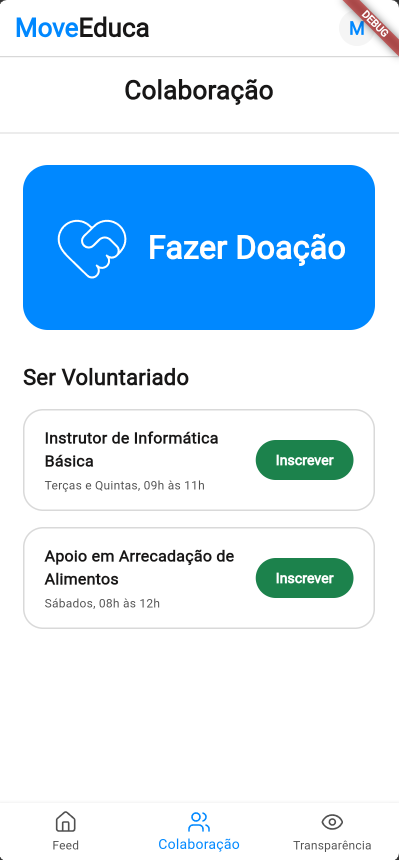
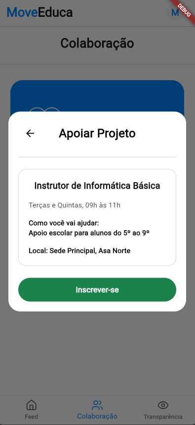
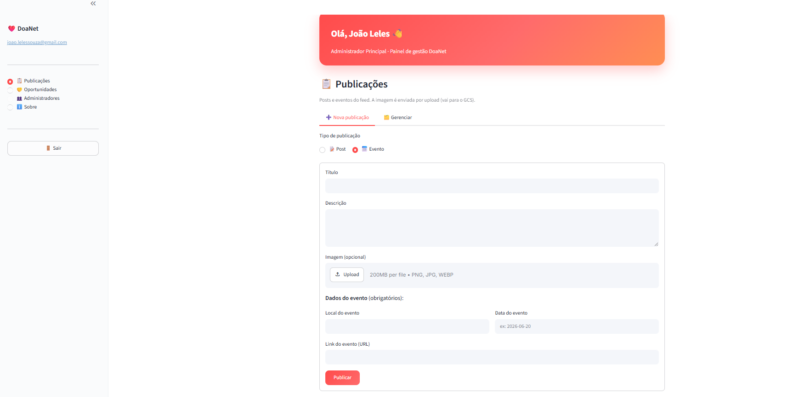
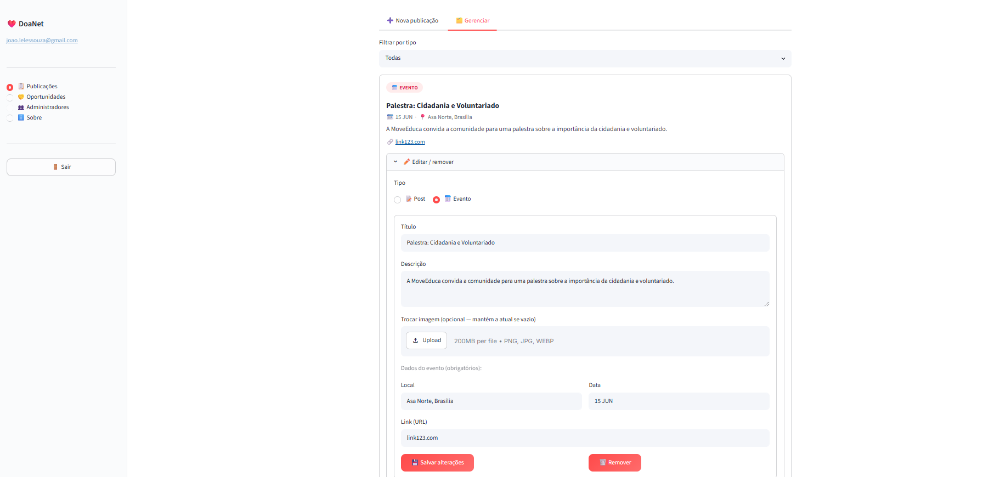
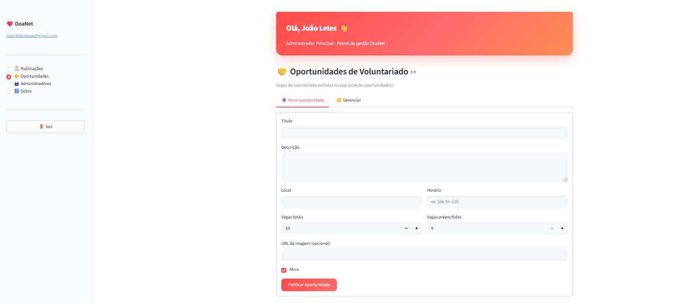
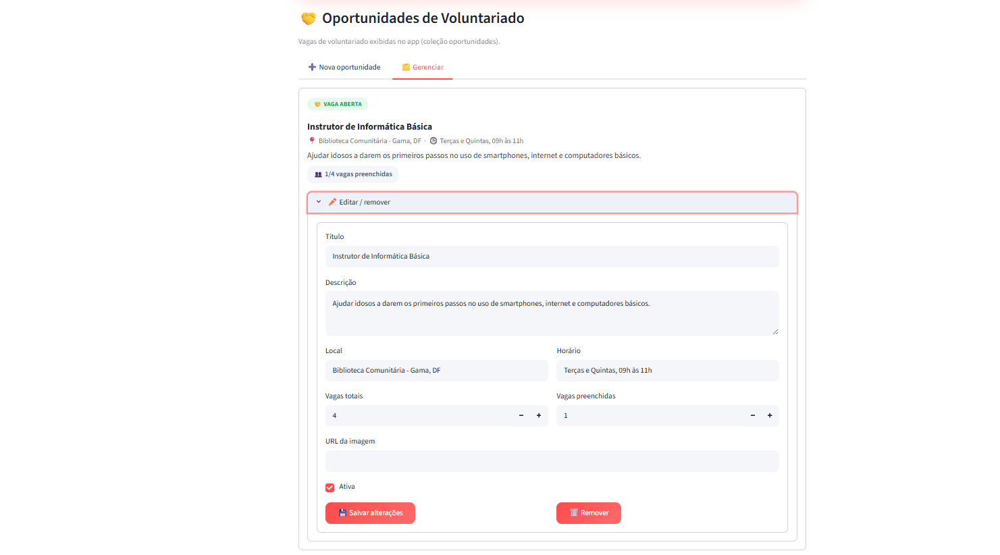

# Evidências — Sprint 4

## User Stories Relacionadas

| US | Descrição |
| :--- | :--- |
| **US04** | Como usuário, quero visualizar oportunidades de voluntariado, para encontrar vagas e formas de ajudar a ONG. |
| **US08** | Como usuário, quero me inscrever para colaborar como voluntário, para participar ativamente preenchendo meus dados dentro do próprio app. |
| **US20** | Como administrador da organização, quero registrar uma oportunidade de voluntariado, para divulgar vagas em aberto para os usuários. |
| **US21** | Como administrador da organização, quero deletar uma oportunidade de voluntariado, para encerrar uma vaga já preenchida. |
| **US22** | Como administrador da organização, quero atualizar uma oportunidade de voluntariado, para alterar requisitos ou o escopo da ajuda necessária. |

> **Débito técnico:** o preenchimento do formulário da oportunidade de voluntariado (US08 / US20) não foi inteiramente concluído nesta sprint.

---

## Descrição da Entrega

Nesta sprint, o grupo se propôs a realizar a parte de colaboração com a organização, registrando a participação em voluntariados e administração do que foi entregue.

**Obs:** Na parte do voluntariado teve um débito técnico onde não foi completado totalmente o preenchimento de formulário da oportunidade de voluntariado.

---

## DoR e DoD

### Definition of Ready — DoR

> Critérios verificados **antes** do início da sprint para garantir que as histórias estavam prontas para desenvolvimento.

| Critério | Status | Evidência |
| :--- | :---: | :--- |
| O requisito possui informação necessária para ser trabalhado? | ✅ | US04, US08, US20, US21 e US22 detalhadas no Story Map com fluxos de CRUD e inscrição definidos |
| O requisito cabe em uma Sprint? | ✅ | 5 USs do módulo de voluntariado planejadas para 2 semanas; encaminhamentos definidos na Ata 5 |
| O requisito está representado por uma história de usuário? | ✅ | US04, US08, US20, US21 e US22 formalizadas no Story Map |
| O requisito está mapeado para uma interface (quando necessário)? | ✅ | Interface do módulo de colaboração baseada no protótipo final validado na Sprint 3 |
| As definições de arquitetura e contratos de API estão claras? | ✅ | Endpoints de voluntariado e painel admin definidos com base na arquitetura consolidada nas sprints anteriores |

### Definition of Done — DoD

> Critérios verificados **ao final** da sprint para confirmar a qualidade e completude das entregas.

| Critério | Status | Evidência |
| :--- | :---: | :--- |
| Entrega um incremento do produto? | ✅ | Módulo de voluntariado (CRUD e inscrição) e painel admin entregues e funcionais |
| Contempla os critérios de aceite estabelecidos? | ⚠️ | Cliente aprovou as entregas na Ata 6; débito técnico identificado no formulário de inscrição de voluntariado |
| Está documentado para uso? | _a preencher_ | _Descrever atualização do Swagger/OpenAPI e comentários relevantes no código_ |
| Está aderente aos padrões de codificação? | ✅ | Desenvolvido em FastAPI (back-end), Flutter (front-end) e Streamlit (admin) |
| Mantém os índices de performance do produto? | _a preencher_ | _Descrever métricas ou testes de performance realizados_ |
| O desenvolvimento foi concluído integralmente? | ⚠️ | Fluxo de voluntariado funcional, porém formulário de inscrição incompleto (débito técnico registrado na Ata 6) |
| O isolamento de dados e segurança foram validados? | _a preencher_ | _Descrever validação da partition key e isolamento multi-tenant_ |
| A conformidade legal e imutabilidade financeira foram aplicadas? | N/A | Não se aplica — sprint sem funcionalidades de pagamento ou doação |
| Os testes foram executados e aprovados? | _a preencher_ | _Descrever testes unitários e de integração realizados_ |
| A funcionalidade foi revisada pela equipe? | _a preencher_ | _Registrar número ou link do Pull Request no GitHub_ |
| A documentação e o feedback relevante foram incorporados? | ✅ | Débito técnico documentado; encaminhamentos para Sprint 5 definidos na Ata 6 |

---

## Evidências do Processo de ER

> Atividades de Engenharia de Requisitos realizadas nesta sprint, conforme o processo ScrumXP definido em [Engenharia de Requisitos](../visao_produto/5-EngenhariadeRequisitos.md).

#### Verificação de Requisitos — Critérios INVEST

Aplicado no Sprint Planning para confirmar que as histórias estavam prontas para desenvolvimento antes de entrar na sprint.

| User Story | I | N | V | E | S | T |
| :--- | :---: | :---: | :---: | :---: | :---: | :---: |
| **US04** — Visualizar oportunidades de voluntariado | ✅ | ✅ | ✅ | ✅ | ✅ | ✅ |
| **US08** — Inscrever-se como voluntário | ✅ | ✅ | ✅ | ✅ | ✅ | ✅ |
| **US20** — Registrar oportunidade de voluntariado (admin) | ✅ | ✅ | ✅ | ✅ | ✅ | ✅ |
| **US21** — Deletar oportunidade de voluntariado (admin) | ✅ | ✅ | ✅ | ✅ | ✅ | ✅ |
| **US22** — Atualizar oportunidade de voluntariado (admin) | ✅ | ✅ | ✅ | ✅ | ✅ | ✅ |

> **I** — Independente · **N** — Negociável · **V** — Valiosa · **E** — Estimável · **S** — Suficientemente pequena · **T** — Testável

#### Critérios de Aceite — Evidências de Cumprimento

Critérios verificados na revisão da sprint e validados com o cliente na [Ata 6](../atas/ata6_09_06_2026.md). Definição completa em [10.3 Critérios de Aceite](../visao_produto/10-story_map.md).

**US04 — Visualizar oportunidades de voluntariado**

- ✅ Listagem exibe todas as oportunidades de voluntariado ativas
- ✅ Cada oportunidade apresenta título, descrição e requisitos
- ✅ Listagem acessível sem autenticação

**US08 — Inscrever-se como voluntário**

- ⚠️ Formulário de inscrição parcialmente implementado — débito técnico registrado na [Ata 6](../atas/ata6_09_06_2026.md)
- ⚠️ Coleta de dados do candidato incompleta; critério de aceite não integralmente satisfeito
- ✅ Inscrições registradas e visíveis para o administrador no painel Streamlit

**US20 — Registrar oportunidade de voluntariado**

- ✅ Administrador cria oportunidade com título, descrição e requisitos
- ✅ Oportunidade exibida imediatamente na listagem após criação
- ✅ Criação restrita a administradores autenticados

**US21 — Deletar oportunidade de voluntariado**

- ✅ Administrador exclui oportunidade da sua organização
- ✅ Oportunidade removida imediatamente da listagem após exclusão
- ✅ Exclusão restrita a administradores autenticados

**US22 — Atualizar oportunidade de voluntariado**

- ✅ Administrador edita título, descrição e requisitos de oportunidade existente
- ✅ Alterações refletidas imediatamente na listagem após salvar
- ✅ Edição restrita a administradores autenticados

#### Validação de Requisitos — Protótipos e Feedback do Cliente

- Módulo de voluntariado (CRUD) e painel de admin demonstrados ao cliente (Paulo) por Letícia na reunião de 09/06.
- Protótipo final (Sprint 3) utilizado como referência para validação da interface do módulo de colaboração.
- Aprovação do incremento e registro do débito técnico no formulário de inscrição documentados na [Ata de Validação S4](../atas/ata6_09_06_2026.md).

#### Organização e Atualização — Refinamento do User Story Map

- Backlog atualizado com os encaminhamentos da revisão da Sprint 3 ([Ata 5](../atas/ata5_26_05_2026.md)) como insumo para o planejamento desta sprint.
- Débito técnico identificado (formulário de voluntariado incompleto) formalizado na [Ata 6](../atas/ata6_09_06_2026.md) e encaminhado para a próxima sprint.

---

## Demonstração em Imagens

---

## Reuniões e Cerimônias Realizadas

### Sprint Planning

> Reunião de definição do escopo, estimativas e comprometimento do time para a sprint.

!!! note "Não registrado separadamente nesta sprint."
    O planejamento da Sprint 4 foi definido pelos encaminhamentos da Revisão da Sprint 3 (Ata 5).

---

### Refinamento do User Story Map

> Reunião interna realizada na semana intermediária da sprint para revisão e detalhamento das histórias do User Story Map.

!!! info "Refinamento do User Story Map — 02/06/2026 · Discord"

    --8<-- "atas/ata_refinamento_s4_02_06_2026.md"

---

### Validação com o Cliente

> Reunião de apresentação do incremento da sprint ao cliente para coleta de feedback e aprovação formal. Participantes: Letícia Vitória (equipe) e Paulo (stakeholder).

!!! success "Aprovação do Voluntariado e Painel Admin — 09/06/2026 · Discord · Letícia e Paulo"

    --8<-- "atas/ata6_09_06_2026.md"

---

### Retrospectiva da Equipe

> Percepções individuais dos membros sobre a sprint e aprendizados coletivos.

**Data:** _a preencher_  
**Participantes:** Davi Ursulino, João Leles, Letícia Vitória, Pedro Augusto e Pedro Druck

#### Comentários dos Membros

**Davi Ursulino**
> As tarefas foram bem definidas e eu entendia exatamente o que precisava ser feito. O que complicou foi a organização pessoal — a semana foi corrida para todo o time e isso gerou alguns atrasos pontuais, o que acabou contribuindo para o débito técnico no formulário.

**João Leles**
> O escopo estava claro e bem dividido, o que ajudou muito. A dificuldade foi a gestão de tempo individual — houve momentos em que tarefas ficaram represadas por conta de comprometimentos externos. No geral entregamos o essencial, mas com menos folga do que gostaríamos.

**Letícia Vitória**
> Sabia bem o que precisava ser feito e o módulo de voluntariado estava bem especificado. Porém, a equipe como um todo sofreu um pouco com organização pessoal nessa sprint — os atrasos foram mais por isso do que por falta de clareza nas tarefas em si.

**Pedro Augusto**
> A definição das tarefas estava boa, mas a execução ficou um pouco abaixo do ritmo da sprint anterior. A correria do período afetou a organização pessoal de cada um, o que resultou em algumas entregas chegando perto do limite. O débito técnico foi consequência direta disso.

**Pedro Druck**
> A sprint foi bem planejada no nível de tarefas, mas a organização individual da equipe não acompanhou o ritmo necessário. Todos entendiam o que precisava ser feito, mas a execução foi mais lenta por questões pessoais de cada membro. Mesmo assim, entregamos o núcleo do módulo de voluntariado.

#### Principais Aprendizados

- Débitos técnicos identificados durante a sprint devem ser formalizados em ata e priorizados explicitamente no planejamento da sprint seguinte; deixá-los implícitos aumenta o risco de acúmulo e compromete a qualidade do produto.
- A integração do painel de admin com múltiplos módulos simultaneamente (feed + voluntariado) reforça a necessidade de contratos de API bem definidos e documentados desde o início do ciclo de desenvolvimento.
- A ausência de parte da equipe nas revisões com o cliente evidencia a importância de garantir presença coletiva nas cerimônias Scrum — especialmente na revisão de sprint, onde o feedback é insumo direto para o planejamento do próximo ciclo.
