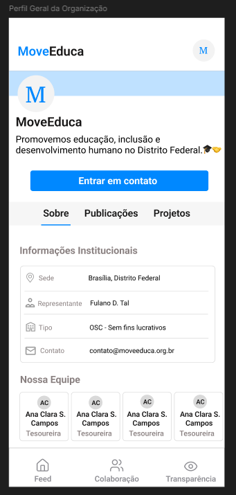

# Observações Gerais sobre o Planejamento

Esta página reúne decisões de planejamento que atravessam mais de uma sprint e, por isso, não pertencem ao registro de nenhuma sprint específica: a ordem de entrega das funcionalidades de maior risco, as histórias antecipadas por oportunidade e as histórias retiradas do MVP.

---

## Por que Doação e Transparência foram entregues apenas após a Sprint 4

O fatiamento do [User Story Map](../user-story-map.md) priorizou, para as primeiras sprints (2–4), a jornada essencial de **comunicação e colaboração** — feed de publicações e eventos, oportunidades de voluntariado e o painel administrativo com autenticação. Doações e transparência ficaram deliberadamente para as Sprints 5 e 6, por três razões:

1. **Risco técnico concentrado** — o fluxo de doações (US10) depende de integração com **gateway de pagamento externo** (Stripe), criptografia e armazenamento imutável (WORM) para rastreabilidade. Pelo critério de priorização (ver [MVP](../../visao_produto/10-story_map.md)), são as histórias de maior complexidade técnica do produto. Atacá-las cedo, sem uma base estável de arquitetura, autenticação e painel admin, aumentaria o risco de retrabalho.

2. **Dependência entre funcionalidades** — o painel de **transparência** (US01) exibe o histórico de doações e despesas; ele só entrega valor real quando existem registros de doação para exibir. Por isso a transparência foi planejada *depois* do fluxo de doações: Sprint 5 implementa doações e o registro inicial na transparência, e a Sprint 6 finaliza o painel.

3. **Estratégia incremental de valor** — entregar cedo o que o cliente podia validar visualmente (feed, eventos, voluntariado) permitiu ciclos curtos de feedback enquanto a base técnica amadurecia. Quando as integrações críticas entraram (Sprint 5), a autenticação, o painel admin e a infraestrutura já estavam consolidados — e a integração com o Stripe foi concluída sem comprometer a sprint.

---

## Filtros e Busca no Feed — entrega na Sprint 5

As histórias [US06 — Filtrar o feed por tipo de publicação](sprint-5/user-stories.md#us06) e [US07 — Buscar publicação no feed por título](sprint-5/user-stories.md#us07) possuem **prioridade baixa e baixo valor agregado** na matriz de priorização — são melhorias de conveniência, não funcionalidades core.

Ainda assim, foram entregues na Sprint 5 por uma razão de custo-benefício: dado o estado de configuração do nosso front-end naquele momento, eram funcionalidades com **alta facilidade de implementação**. O feed já mantinha a lista de publicações em estado local no Flutter, então filtro por tipo e busca por título se resumiram a operações de filtragem client-side sobre dados já carregados — sem novas rotas no back-end, sem mudança de arquitetura e sem risco para o fluxo principal da sprint (doações). O esforço marginal quase nulo justificou a antecipação, mesmo com prioridade baixa.

---

## Histórias fora do MVP: US03 e US05

As histórias abaixo foram **removidas do escopo da Sprint 6 e do MVP**. Ambas apresentavam **prioridade baixa** na matriz de priorização e **baixa entrega de valor** para o objetivo central do produto — a tela de perfil da organização é informativa e estática, e o contato pode ser suprido por canais externos já existentes da ONG (redes sociais, site). Diante do prazo fixo da entrega final, a equipe optou por concentrar a Sprint 6 nas histórias de maior valor (transparência, gestão de administradores e customização White Label).

### US03 — Visualizar descrição da ONG

> Como usuário, quero visualizar uma descrição institucional da organização, para entender seu propósito e áreas de atuação.

**Critérios de aceite:**

- A tela exibe nome, missão e descrição da organização.
- As informações refletem os dados configurados pelo administrador.
- A página é acessível sem autenticação.

**Protótipo da US:**

**Fluxo de navegação previsto (aplicativo mobile):** `Abrir app → aba Perfil da Organização → Descrição institucional`

**Status:** ➖ Fora do MVP — não implementada. Prioridade baixa e baixa entrega de valor frente às demais histórias da sprint de fechamento.

---

### US05 — Contactar a organização

> Como usuário, quero contactar os administradores da organização de forma integrada, para tirar dúvidas ou buscar mais informações.

**Critérios de aceite:**

- O usuário acessa um canal de contato direto com a organização a partir da tela de perfil.
- O canal redireciona corretamente para o meio configurado (ex: WhatsApp, e-mail).

**Protótipo da US:**

**Fluxo de navegação previsto (aplicativo mobile):** `Abrir app → aba Perfil da Organização → Contato (WhatsApp/e-mail)`

**Status:** ➖ Fora do MVP — não implementada. Prioridade baixa e baixa entrega de valor; o contato com a organização permanece disponível pelos canais externos já utilizados pela ONG.
