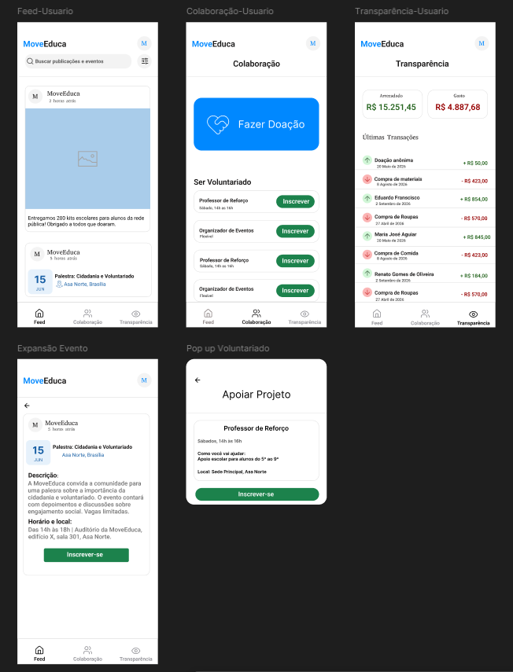
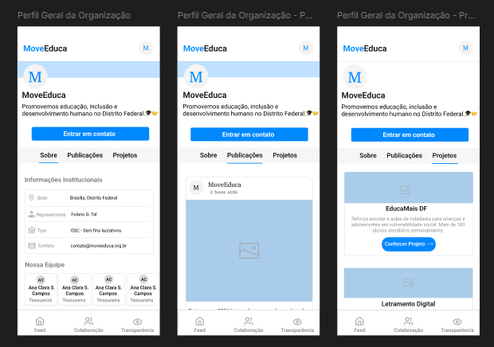

# Sprint 1 — Engenharia de Software

[← Voltar ao Objetivo Geral](objetivo-geral.md)

## Descrição da Entrega

O time estruturou a base do projeto DoaNet e validou a direção do produto junto ao cliente. A principal entrega foi a **construção e validação do protótipo de baixa fidelidade**, garantindo alinhamento sobre as funcionalidades e a interface antes do início do desenvolvimento, além da definição da arquitetura, do mapeamento dos requisitos iniciais e da elaboração do User Story Map.

## Protótipo

Protótipo interativo de baixa/média fidelidade desenvolvido no Figma e validado com o cliente durante esta sprint.

<iframe
  style="border: 1px solid rgba(0,0,0,0.1); border-radius: 4px;"
  width="100%"
  height="650"
  src="https://www.figma.com/embed?embed_host=share&url=https%3A%2F%2Fwww.figma.com%2Fproto%2FoWLaaxEIGdP92BsHEt3xAt%2FDoaNet---Prot%25C3%25B3tipo-baixa-fidelidade--c%25C3%25B3pia-%3Fnode-id%3D284-23%26p%3Df%26t%3DCZMpoXMKlitpFLKD-1%26scaling%3Dscale-down%26content-scaling%3Dfixed%26page-id%3D0%253A1%26starting-point-node-id%3D284%253A23%26show-proto-sidebar%3D1"
  allowfullscreen>
</iframe>

## DoR e DoD

!!! note "DoR/DoD por User Story não aplicável nesta sprint"
    A Sprint 1 não contemplou o desenvolvimento de User Stories funcionais — seu produto foi a representação de requisitos (USM) e o protótipo. Portanto, **não houve verificação de DoR/DoD por história**. Os critérios de **Definition of Ready** e **Definition of Done** do time estão definidos em [DOR e DOD](../../../visao_produto/9-DorEDod.md) e passaram a ser aplicados por US a partir da Sprint 2.

**Evidências da entrega:**

- Protótipo validado e descrição da entrega — ver seção [Protótipo](#prototipo) acima.
- Aprovação formal do incremento (USM + protótipo) — [Ata de Validação S1](../../../atas/ata_validacao_s1_27_04_2026.md).
