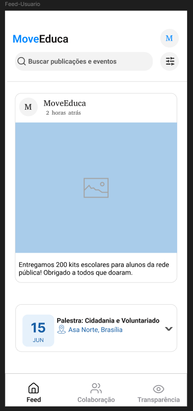
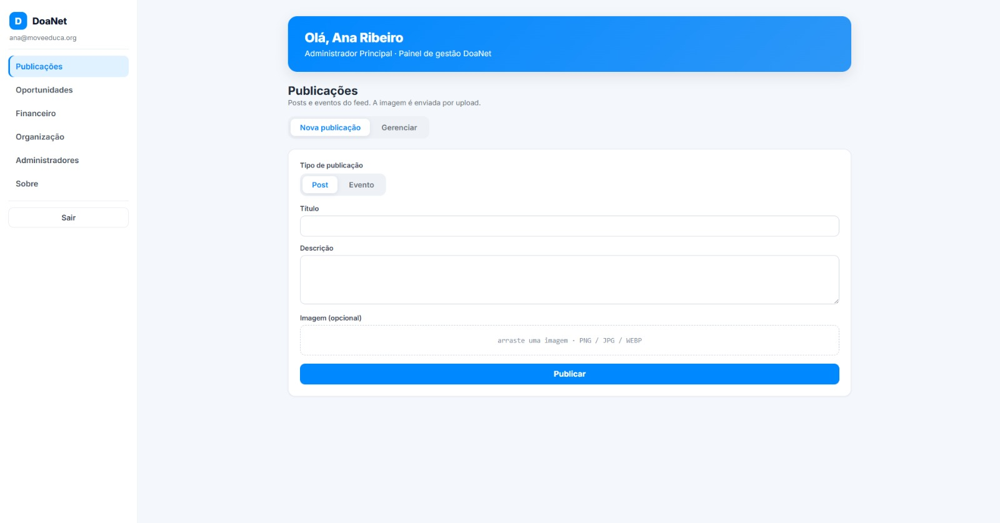
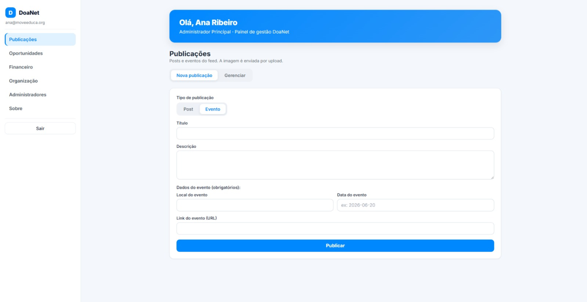
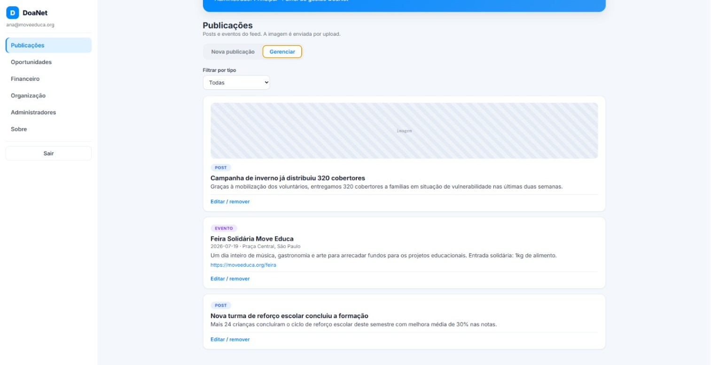

# Sprint 2 — User Stories

[← Voltar ao Objetivo Geral](objetivo-geral.md)

## US02 — Visualizar publicações no feed

> Como usuário, quero visualizar as publicações no feed, para me manter atualizado sobre as ações e eventos da organização.

**Critérios de Aceite:**

- O feed exibe publicações em ordem cronológica decrescente.
- Cada publicação apresenta título, data de criação e imagem (quando disponível).
- O feed exibe tanto posts normais quanto posts de eventos.
- O feed é acessível sem autenticação.

**Protótipo da US:** 

**Fluxo de acesso:** Abrir aba feed → Visualizar as publicações do feed

**PR associado:** 🔗[Pull Request #26](https://github.com/mdsreq-fga-unb/REQ-2026.1-T01-DoaNet/pull/26)

## US17 — Criar publicação no feed (post normal)

> Como administrador da organização, quero criar uma nova publicação no feed (normal ou evento), para me comunicar com os apoiadores.

**Critérios de aceite:**

- O administrador consegue criar uma publicação normal com título, texto e imagem opcional.
- O administrador consegue criar uma publicação de evento com título, texto, data do evento e imagem opcional.
- A publicação é exibida imediatamente no feed após criação.
- Apenas administradores autenticados conseguem criar publicações.

**Protótipo da US:** 

**Rota de acesso (Streamlit — painel admin):** `http://localhost:8501` → seção **📋 Publicações** → aba **➕ Nova publicação**

**PR associado:** 🔗[Pull Request #37](https://github.com/mdsreq-fga-unb/REQ-2026.1-T01-DoaNet/pull/37)

---

## US18 — Deletar publicação no feed

> Como administrador da organização, quero deletar uma publicação no feed, para remover um aviso incorreto ou que não seja mais pertinente.

**Critérios de aceite:**

- O administrador consegue excluir qualquer publicação do feed da sua organização.
- A publicação é removida imediatamente do feed após exclusão.
- Apenas administradores autenticados conseguem excluir publicações.

**Protótipo da US:**

**Rota de acesso (Streamlit — painel admin):** `http://localhost:8501` → seção **📋 Publicações** → aba **🗂️ Gerenciar** → **🗑️ Remover**

**PR associado:** 🔗[Pull Request #37](https://github.com/mdsreq-fga-unb/REQ-2026.1-T01-DoaNet/pull/37)

---

## US19 — Atualizar publicação no feed

> Como administrador da organização, quero atualizar uma publicação no feed, para corrigir ou adicionar detalhes importantes.

**Critérios de aceite:**

- O administrador consegue editar título, texto e imagem de uma publicação existente.
- As alterações são refletidas imediatamente no feed após salvar.
- Apenas administradores autenticados conseguem editar publicações.

**Protótipo da US:**

**Rota de acesso (Streamlit — painel admin):** `http://localhost:8501` → seção **📋 Publicações** → aba **🗂️ Gerenciar** → **💾 Salvar alterações**

**PR associado:** 🔗[Pull Request #37](https://github.com/mdsreq-fga-unb/REQ-2026.1-T01-DoaNet/pull/37)

---

> Evidências de cumprimento dos critérios: [Engenharia de Requisitos — Critérios de Aceite](engenharia-de-requisitos.md#criterios-de-aceite-evidencias-de-cumprimento)
