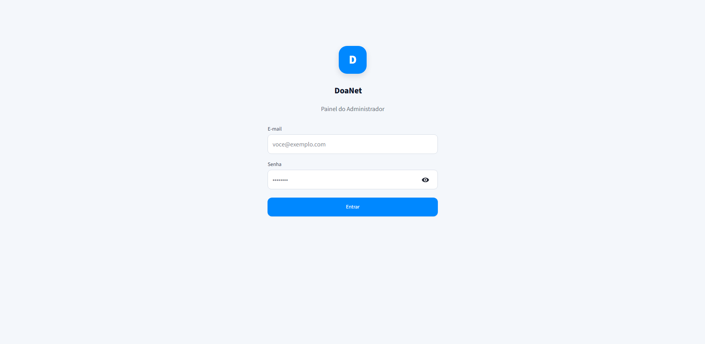
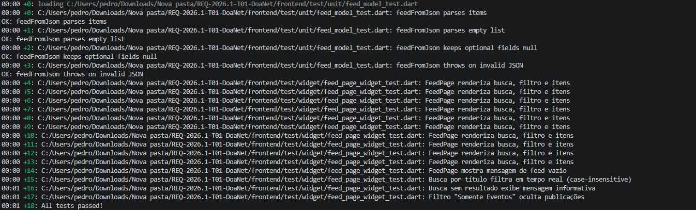
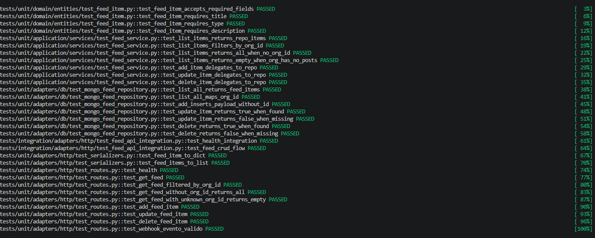

# Sprint 3 — Engenharia de Software

[← Voltar ao Objetivo Geral](objetivo-geral.md)

## Descrição da Entrega

Implementação de posts de eventos com inscrição, adição de imagens em todos os tipos de post e início do módulo de administração. O objetivo foi refinar os posts comuns, adicionar os eventos e as opções de administrador.

## Definition of Ready — DoR

> Critérios verificados **antes** do início da sprint.

| Critério | Status | Evidência |
| :--- | :---: | :--- |
| O requisito possui informação necessária para ser trabalhado? | ✅ | US09 e US11 detalhadas no Story Map com comportamentos de inscrição e autenticação definidos |
| O requisito cabe em uma Sprint? | ✅ | 2 USs concluídas dentro das 2 semanas; encaminhamentos definidos na [Ata 4](../../../atas/ata4_12_05_2026.md) |
| Os critérios de aceitação estão definidos? | ✅ | US09 e US11 formalizadas no Story Map |
| O requisito está representado por uma história de usuário? | ✅ | Requisitos representados por US09 e US11 |
| As definições de arquitetura e contratos de API estão claras? | ✅ | Endpoints de eventos e módulo de autenticação Streamlit definidos com base na arquitetura da Sprint 2 |

## Definition of Done — DoD

> Critérios verificados **ao final** da sprint.

| Critério | Status | Evidência |
| :--- | :---: | :--- |
| Entrega um incremento do produto? | ✅ | Feed completo com eventos e inscrição; início do módulo admin entregues |
| Contempla os critérios de aceite estabelecidos? | ✅ | Cliente validou e aprovou o feed completo e o módulo admin na [Ata 5 (26/05)](../../../atas/ata5_26_05_2026.md) |
| O desenvolvimento foi concluído integralmente? | ✅ | CRUD de eventos, inscrição em eventos e autenticação admin funcionando de ponta a ponta |
| Os testes foram executados e aprovados? | ✅ | Ver [Evidências de execução dos testes](#evidencias-testes) |
| A funcionalidade foi revisada pela equipe? | ✅ | Revisão realizada no [Pull Request #36](https://github.com/mdsreq-fga-unb/REQ-2026.1-T01-DoaNet/pull/36) e no [Pull Request #37](https://github.com/mdsreq-fga-unb/REQ-2026.1-T01-DoaNet/pull/37) |
| A documentação e o feedback relevante foram incorporados? | ✅ | Protótipo final alinhado e validado pelo cliente; feedback da [Ata 5](../../../atas/ata5_26_05_2026.md) incorporado |

## Demonstração em Imagens

## Evidências de execução dos testes

### Front-end

### Back-end

