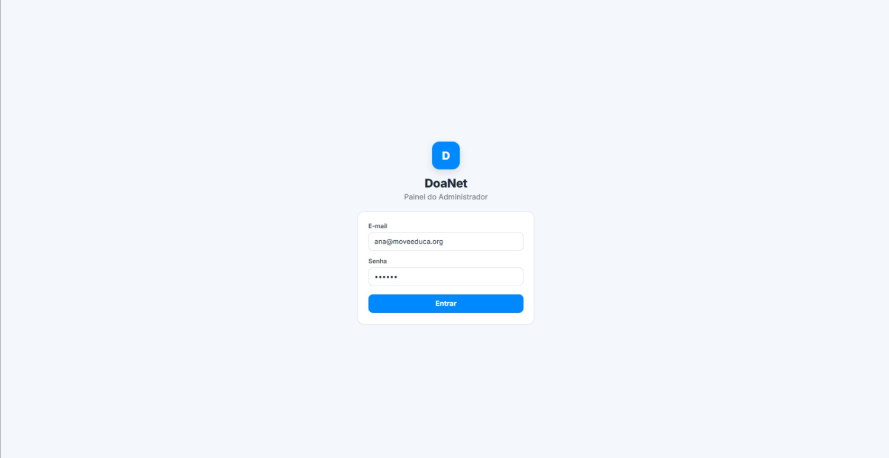

# Sprint 3 — User Stories

[← Voltar ao Objetivo Geral](objetivo-geral.md)

## US09 — Inscrever-se em evento

> Como usuário, quero me inscrever para atender a um evento divulgado, para confirmar minha presença e participação.

**Critérios de aceite:**

- O usuário consegue se inscrever em um evento a partir da publicação no feed.
- A inscrição é registrada e visível para o administrador.
- O usuário recebe confirmação visual após inscrição bem-sucedida.
- O sistema impede inscrição duplicada no mesmo evento.

**Protótipo da US:**

**Fluxo de navegação (aplicativo mobile):** `Abrir app → aba Feed → publicação de evento → Inscrever-se → Confirmação`

**PR associado:** 🔗[Pull Request #36](https://github.com/mdsreq-fga-unb/REQ-2026.1-T01-DoaNet/pull/36)

---

## US11 — Autenticar login de administradores

> Como administrador, quero me autenticar na plataforma, para acessar o painel de gestão correspondente ao meu nível hierárquico.

**Critérios de aceite:**

- O administrador consegue fazer login com credenciais válidas (e-mail + senha).
- Credenciais inválidas retornam mensagem de erro sem expor detalhes técnicos.
- Após autenticação, o painel exibe apenas as funcionalidades do nível hierárquico do admin.
- A sessão é encerrada após logout explícito.

**Protótipo da US:**

**Rota de acesso (Streamlit — painel admin):** `https://painel-adm-lkhp.onrender.com/` → tela de **Login** do painel administrativo

**PR associado:** 🔗[Pull Request #37](https://github.com/mdsreq-fga-unb/REQ-2026.1-T01-DoaNet/pull/37)

---

> Evidências de cumprimento dos critérios: [Engenharia de Requisitos — Critérios de Aceite](engenharia-de-requisitos.md#criterios-de-aceite)
