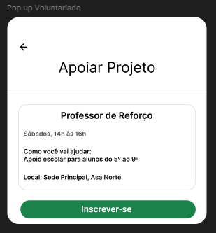

# Sprint 4 — User Stories

[← Voltar ao Objetivo Geral](objetivo-geral.md)

## US04 — Visualizar oportunidades de voluntariado

> Como usuário, quero visualizar oportunidades de voluntariado, para encontrar vagas e formas de ajudar a ONG.

**Critérios de aceite:**

- A listagem exibe todas as oportunidades de voluntariado ativas.
- Cada oportunidade apresenta título, descrição e requisitos.
- A listagem é acessível sem autenticação.

**Protótipo da US:** _Captura do protótipo de alta fidelidade desta US a ser inserida._

**Fluxo de navegação (aplicativo mobile):** `Abrir app → aba Colaboração → Lista de oportunidades de voluntariado`

**Protótipo:**

**PR associado:** 🔗[Pull Request #38](https://github.com/mdsreq-fga-unb/REQ-2026.1-T01-DoaNet/pull/38)

---

## US08 — Inscrever-se como voluntário 🔧 *(débito técnico)*

> Como usuário, quero me inscrever para colaborar como voluntário, para participar ativamente preenchendo meus dados dentro do próprio app.

**Critérios de aceite:**

- O formulário de inscrição coleta nome, contato e motivação do candidato.
- A inscrição é registrada e visível para o administrador no painel Streamlit.
- O usuário recebe confirmação visual após envio bem-sucedido.

**Protótipo da US:** _Captura do protótipo de alta fidelidade desta US a ser inserida._

**Fluxo de navegação (aplicativo mobile):** `Abrir app → aba Colaboração → selecionar oportunidade → Inscrever-se → Formulário de inscrição → Confirmação`

**Protótipo:**

**PR associado:** 🔗[Pull Request #38](https://github.com/mdsreq-fga-unb/REQ-2026.1-T01-DoaNet/pull/38)

!!! warning "Débito técnico"
    O preenchimento do formulário da oportunidade de voluntariado **não foi inteiramente concluído** nesta sprint. Item formalmente registrado e encaminhado para a Sprint 5 — ver [Engenharia de Software](engenharia-de-software.md#débito-técnico) e [Ata de Validação S4](../../../atas/ata6_09_06_2026.md).

---

## US20 — Registrar oportunidade de voluntariado (admin)

> Como administrador da organização, quero registrar uma oportunidade de voluntariado, para divulgar vagas em aberto para os usuários.

**Critérios de aceite:**

- O administrador consegue criar uma oportunidade informando título, descrição e requisitos.
- A oportunidade é exibida imediatamente na listagem de voluntariado após criação.
- Apenas administradores autenticados conseguem registrar oportunidades.

**Protótipo da US:** _Captura do protótipo de alta fidelidade desta US a ser inserida._

**Rota de acesso (Streamlit — painel admin):** `http://localhost:8501` → seção **🤝 Oportunidades** → aba **➕ Nova oportunidade**

**PR associado:** 🔗[Pull Request #37](https://github.com/mdsreq-fga-unb/REQ-2026.1-T01-DoaNet/pull/37)

---

## US21 — Deletar oportunidade de voluntariado (admin)

> Como administrador da organização, quero deletar uma oportunidade de voluntariado, para encerrar uma vaga já preenchida.

**Critérios de aceite:**

- O administrador consegue excluir qualquer oportunidade de voluntariado da sua organização.
- A oportunidade é removida imediatamente da listagem após exclusão.
- Apenas administradores autenticados conseguem excluir oportunidades.

**Protótipo da US:** _Captura do protótipo de alta fidelidade desta US a ser inserida._

**Rota de acesso (Streamlit — painel admin):** `http://localhost:8501` → seção **🤝 Oportunidades** → aba **🗂️ Gerenciar** → **🗑️ Remover**

**PR associado:** 🔗[Pull Request #37](https://github.com/mdsreq-fga-unb/REQ-2026.1-T01-DoaNet/pull/37)

---

## US22 — Atualizar oportunidade de voluntariado (admin)

> Como administrador da organização, quero atualizar uma oportunidade de voluntariado, para alterar requisitos ou o escopo da ajuda necessária.

**Critérios de aceite:**

- O administrador consegue editar título, descrição e requisitos de uma oportunidade existente.
- As alterações são refletidas imediatamente na listagem após salvar.
- Apenas administradores autenticados conseguem editar oportunidades.

**Protótipo da US:** _Captura do protótipo de alta fidelidade desta US a ser inserida._

**Rota de acesso (Streamlit — painel admin):** `http://localhost:8501` → seção **🤝 Oportunidades** → aba **🗂️ Gerenciar** → **💾 Salvar alterações**

**PR associado:** 🔗[Pull Request #37](https://github.com/mdsreq-fga-unb/REQ-2026.1-T01-DoaNet/pull/37)

---

> Evidências de cumprimento dos critérios: [Engenharia de Requisitos — Critérios de Aceite](engenharia-de-requisitos.md#criterios-de-aceite-evidencias-de-cumprimento)
