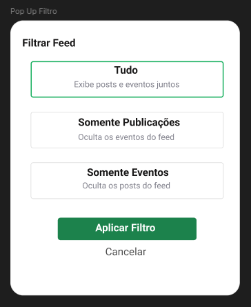
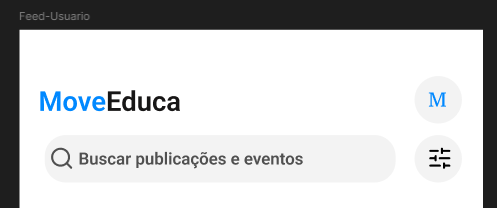
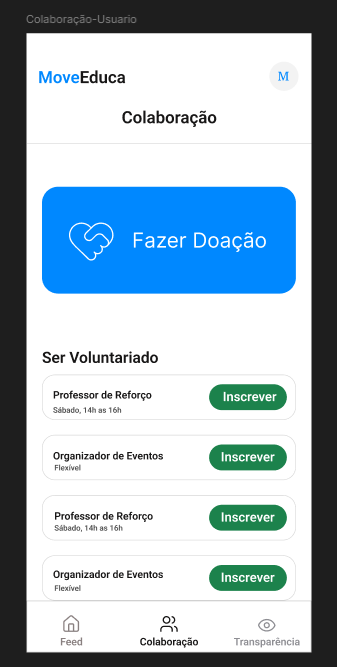
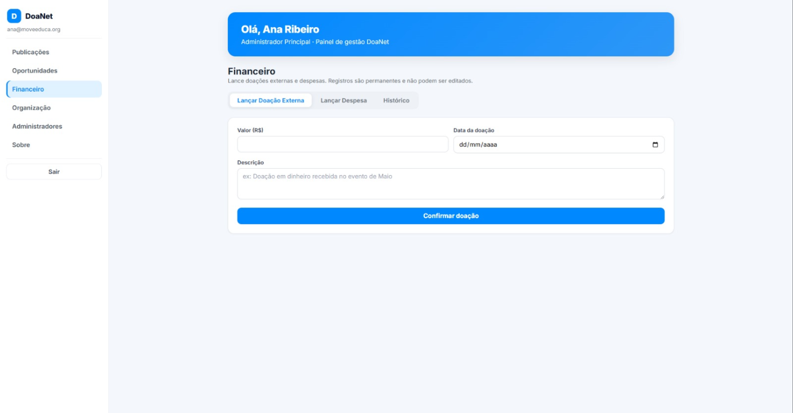
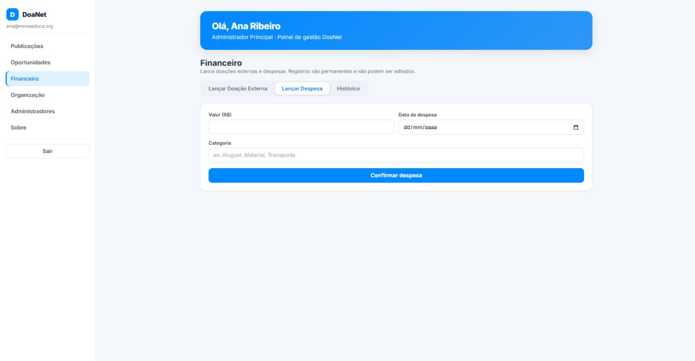

# Sprint 5 — User Stories

[← Voltar ao Objetivo Geral](objetivo-geral.md)

## US06 — Filtrar o feed por tipo de publicação

> Como usuário, quero filtrar o feed por tipo de publicação (normal ou evento), para visualizar rapidamente atualizações ou eventos específicos.

**Critérios de aceite:**

- O usuário consegue filtrar o feed por tipo de publicação (normal ou evento).
- O filtro é aplicado sem recarregar a tela.
- Ao remover o filtro, o feed retorna ao estado padrão com todas as publicações.

**Protótipo da US:**

**Fluxo de navegação (aplicativo mobile):** `Abrir app → aba Feed → Filtro por tipo (normal/evento)`

**PR associado:** 🔗[Pull Request #60](https://github.com/mdsreq-fga-unb/REQ-2026.1-T01-DoaNet/pull/60)

---

## US07 — Buscar publicação no feed por título

> Como usuário, quero buscar publicações no feed pelo título, para encontrar rapidamente postagens de meu interesse.

**Critérios de aceite:**

- O campo de busca filtra publicações em tempo real conforme o usuário digita.
- A busca não diferencia maiúsculas de minúsculas.
- Quando nenhum resultado é encontrado, uma mensagem informativa é exibida.

**Protótipo da US:**

**Fluxo de navegação (aplicativo mobile):** `Abrir app → aba Feed → Campo de busca por título`

**PR associado:** 🔗[Pull Request #60](https://github.com/mdsreq-fga-unb/REQ-2026.1-T01-DoaNet/pull/60)

---

## US10 — Realizar doação

> Como doador, quero realizar uma doação escolhendo seu direcionamento e visibilidade (pública/anônima), para apoiar financeiramente a causa.

**Critérios de aceite:**

- O fluxo permite selecionar valor e direcionamento da doação.
- O doador escolhe entre visibilidade pública (nome exibido) ou anônima.
- O registro é imutável após confirmação do pagamento.
- A transação é processada por gateway de pagamento com criptografia.

**Protótipo da US:**

**Fluxo de navegação (aplicativo mobile):** `Abrir app → aba Colaboração → Fazer Doação → Selecionar valor e visibilidade → Confirmar doação`

**PR associado:** 🔗[Pull Request #59](https://github.com/mdsreq-fga-unb/REQ-2026.1-T01-DoaNet/pull/59)

---

## US15 — Lançar doações manuais (admin)

> Como administrador da organização, quero lançar manualmente doações feitas fora do aplicativo, para centralizar e imortalizar os registros na transparência.

**Critérios de aceite:**

- O administrador consegue registrar uma doação informando valor, data e descrição.
- O registro é imediatamente visível no histórico de transparência para os usuários.
- O registro é imutável após confirmação — não pode ser editado ou excluído.

**Protótipo da US:**

**Rota de acesso (Streamlit — painel admin):** [painel-adm-lkhp.onrender.com](https://painel-adm-lkhp.onrender.com/) → seção **💵 Financeiro** → **Lançar Doação Externa**

**PR associado:** 🔗[Pull Request #55](https://github.com/mdsreq-fga-unb/REQ-2026.1-T01-DoaNet/pull/55)

---

## US16 — Lançar despesas operacionais (admin)

> Como administrador da organização, quero lançar despesas operacionais, para prestar contas aos doadores publicamente.

**Critérios de aceite:**

- O administrador consegue registrar uma despesa informando valor, data e categoria.
- O registro é imediatamente visível no histórico de transparência para os usuários.
- O registro é imutável após confirmação — não pode ser editado ou excluído.

**Protótipo da US:**

**Rota de acesso (Streamlit — painel admin):** [painel-adm-lkhp.onrender.com](https://painel-adm-lkhp.onrender.com/) → seção **💵 Financeiro** → **Lançar Despesa**

**PR associado:** 🔗[Pull Request #55](https://github.com/mdsreq-fga-unb/REQ-2026.1-T01-DoaNet/pull/55)

---

> Evidências de cumprimento dos critérios: [Engenharia de Requisitos — Critérios de Aceite](engenharia-de-requisitos.md#criterios-de-aceite-evidencias-de-cumprimento)
