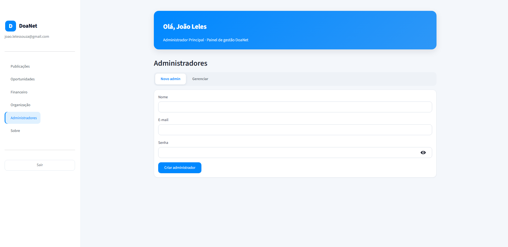
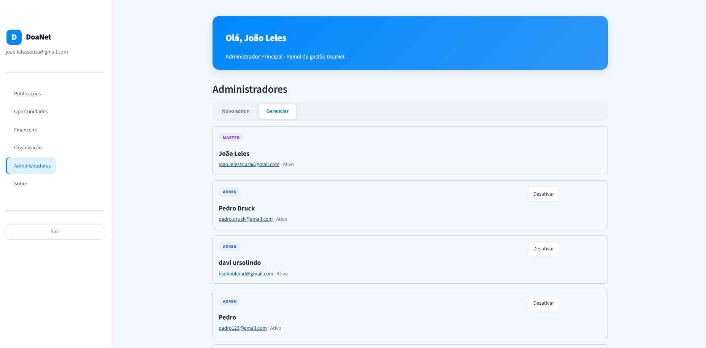
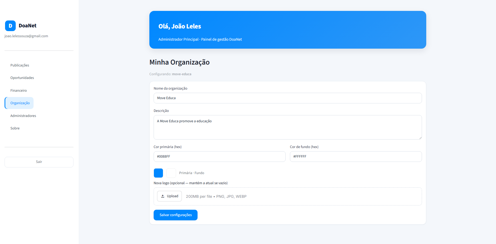
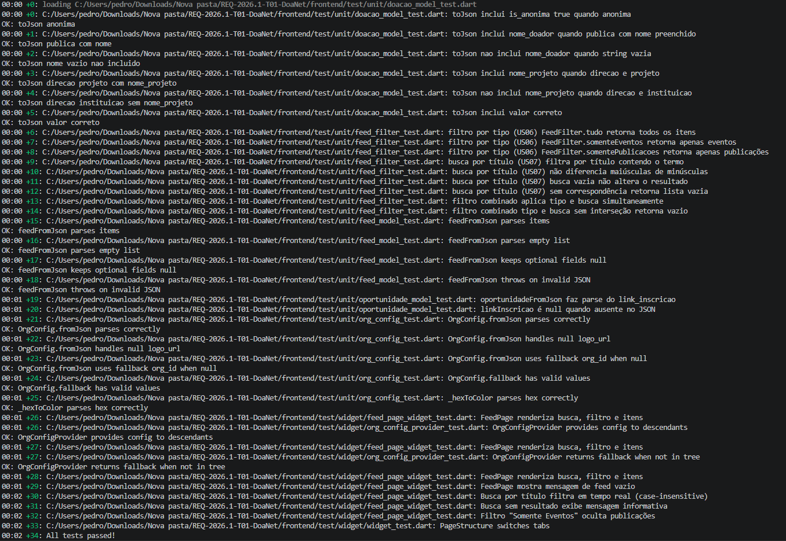
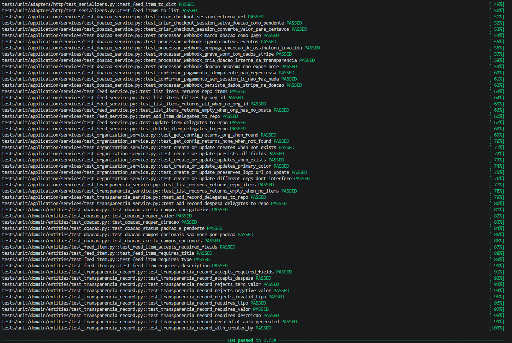

# Sprint 6 — Engenharia de Software

[← Voltar ao Objetivo Geral](objetivo-geral.md)

## Descrição da Entrega

Fechamento do painel de transparência (visualização do histórico financeiro pelo usuário), da tela de descrição e contato da organização, da gestão de administradores e da customização (White Label). Corresponde à entrega final do projeto.

## Definition of Ready — DoR

> Critérios verificados **antes** do início da sprint.

| Critério | Status | Evidência |
| :--- | :---: | :--- |
| O requisito possui informação necessária para ser trabalhado? | ✅ | US01, US03, US05, US12, US13 e US14 detalhadas no Story Map |
| O requisito cabe em uma Sprint? | ✅ | 6 USs planejadas para a sprint de fechamento |
| Os critérios de aceitação estão definidos? | ✅ | Critérios formalizados em [User Stories](user-stories.md) |
| O requisito está representado por uma história de usuário? | ✅ | Requisitos representados por US01, US03, US05, US12, US13 e US14 |
| As definições de arquitetura e contratos de API estão claras? | ✅ | Endpoints de transparência, organização e administração definidos sobre a arquitetura consolidada |

## Definition of Done — DoD

> Critérios verificados **ao final** da sprint.

| Critério | Status | Evidência |
| :--- | :---: | :--- |
| Entrega um incremento do produto? | ⚠️ | Funcionalidades de transparência, perfil e gestão de admin em finalização |
| Contempla os critérios de aceite estabelecidos? | ✅ | Verificação a concluir na revisão final — ver [Engenharia de Requisitos](engenharia-de-requisitos.md#criterios-de-aceite-evidencias-de-cumprimento) |
| O desenvolvimento foi concluído integralmente? | ⚠️ | Visualização do histórico financeiro, cadastro e remoção dos administradores das organizações entregues |
| Os testes foram executados e aprovados? | ✅ | Ver [Evidências de execução dos testes](#evidencias-testes) |
| A funcionalidade foi revisada pela equipe? | ✅ | Revisão realizada no [Pull Request #37](https://github.com/mdsreq-fga-unb/REQ-2026.1-T01-DoaNet/pull/37), [Pull Request #47](https://github.com/mdsreq-fga-unb/REQ-2026.1-T01-DoaNet/pull/47) e [Pull Request #48](https://github.com/mdsreq-fga-unb/REQ-2026.1-T01-DoaNet/pull/48) |
| A documentação e o feedback relevante foram incorporados? | ✅ | Em andamento; consolidação na entrega final (02/07) |

## Demonstração em Imagens

## Evidências de execução dos testes

### Front-end

### Back-end

