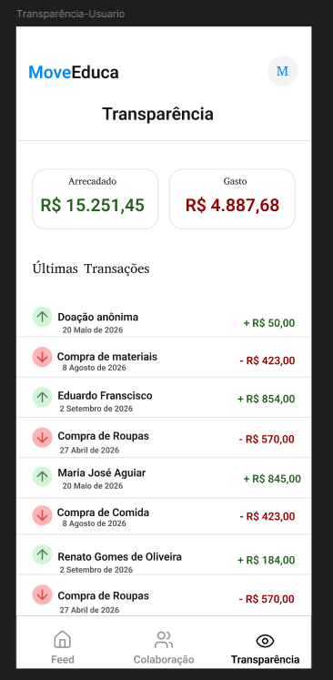
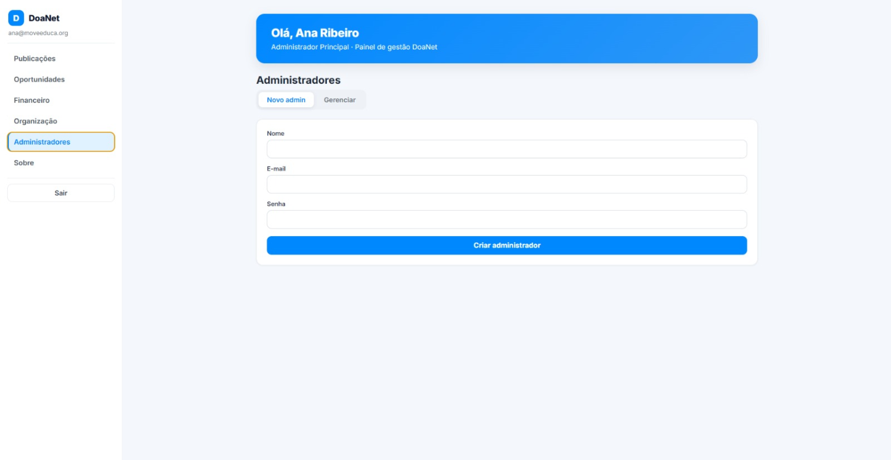
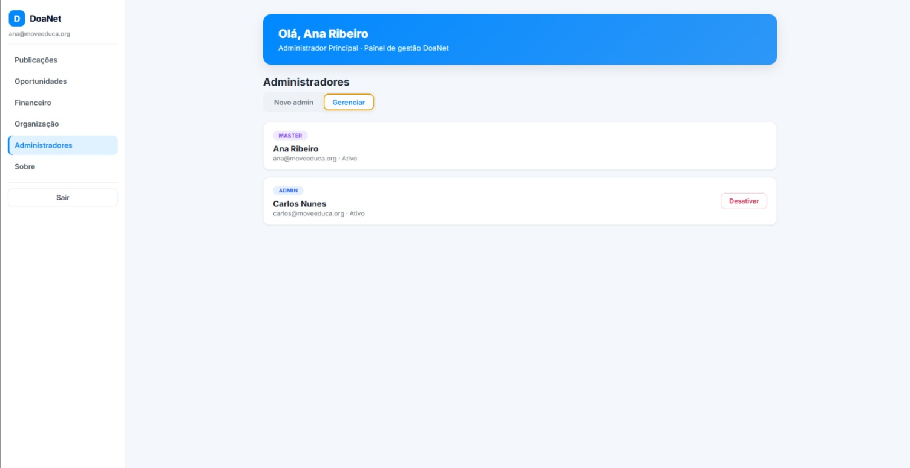
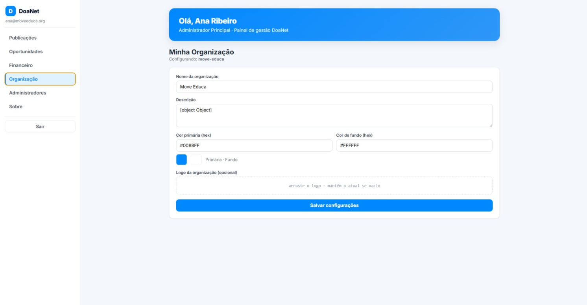

# Sprint 6 — User Stories

[← Voltar ao Objetivo Geral](objetivo-geral.md)

## US01 — Visualizar histórico financeiro

> Como usuário, quero visualizar o histórico de doações e despesas da organização, para acompanhar a transparência financeira de forma auditável.

**Critérios de aceite:**

- O histórico exibe doações e despesas em ordem cronológica decrescente.
- Cada registro apresenta tipo (doação/despesa), valor, data e descrição.
- O histórico é acessível sem autenticação pelo usuário comum.
- Os registros são imutáveis após lançamento — não podem ser editados ou excluídos.

**Protótipo da US:**

**Fluxo de navegação (aplicativo mobile):** `Abrir app → aba Transparência → Histórico de doações e despesas`

**PR associado:** 🔗[Pull Request #47](https://github.com/mdsreq-fga-unb/REQ-2026.1-T01-DoaNet/pull/47)

---

## US03 — Visualizar descrição da ONG

> Como usuário, quero visualizar uma descrição institucional da organização, para entender seu propósito e áreas de atuação.

**Critérios de aceite:**

- A tela exibe nome, missão e descrição da organização.
- As informações refletem os dados configurados pelo administrador.
- A página é acessível sem autenticação.

**Protótipo da US:**

**Fluxo de navegação (aplicativo mobile):** `Abrir app → aba Perfil da Organização → Descrição institucional`

---

## US05 — Contactar a organização

> Como usuário, quero contactar os administradores da organização de forma integrada, para tirar dúvidas ou buscar mais informações.

**Critérios de aceite:**

- O usuário acessa um canal de contato direto com a organização a partir da tela de perfil.
- O canal redireciona corretamente para o meio configurado (ex: WhatsApp, e-mail).

**Protótipo da US:** 

**Fluxo de navegação (aplicativo mobile):** `Abrir app → aba Perfil da Organização → Contato (WhatsApp/e-mail)`

---

## US12 — Cadastrar administrador de organização (admin)

> Como Administrador Geral, quero cadastrar um novo administrador para uma organização, para provisionar seu acesso ao painel de gestão.

**Critérios de aceite:**

- O administrador geral consegue cadastrar um novo admin informando nome, e-mail e organização vinculada.
- O novo administrador acessa o painel imediatamente com as credenciais criadas.
- O sistema impede o cadastro de dois administradores com o mesmo e-mail.

**Protótipo da US:** 

**Rota de acesso (Streamlit — painel admin):** [painel-adm-lkhp.onrender.com](https://painel-adm-lkhp.onrender.com/) → seção **👥 Administradores** → aba **➕ Novo admin**

**PR associado:** 🔗[Pull Request #37](https://github.com/mdsreq-fga-unb/REQ-2026.1-T01-DoaNet/pull/37)

---

## US13 — Remover administrador de organização (admin)

> Como Administrador Geral, quero remover um administrador de organização, para revogar seu acesso e controle sobre o painel.

**Critérios de aceite:**

- O administrador geral consegue remover qualquer administrador de organização.
- O acesso do administrador removido é revogado imediatamente após a remoção.
- A remoção não afeta dados históricos criados pelo administrador removido.

**Protótipo da US:**

**Rota de acesso (Streamlit — painel admin):** [painel-adm-lkhp.onrender.com](https://painel-adm-lkhp.onrender.com/) → seção **👥 Administradores** → aba **🗂️ Gerenciar** → **Desativar**

**PR associado:** 🔗[Pull Request #37](https://github.com/mdsreq-fga-unb/REQ-2026.1-T01-DoaNet/pull/37)

---

## US14 — Configurar dados institucionais (admin)

> Como administrador da organização, quero configurar os dados de customização, para manter a interface do aplicativo alinhada ao branding da ONG (White Label).

**Critérios de aceite:**

- O administrador consegue configurar nome, logotipo e cores da organização.
- As alterações são refletidas na interface do aplicativo em tempo real.
- Apenas administradores autenticados conseguem alterar os dados institucionais.

**Protótipo da US:**

**Rota de acesso (Streamlit — painel admin):** [painel-adm-lkhp.onrender.com](https://painel-adm-lkhp.onrender.com/) → seção **🏢 Organização**

**PR associado:** 🔗[Pull Request #48](https://github.com/mdsreq-fga-unb/REQ-2026.1-T01-DoaNet/pull/48)

---

> Evidências de cumprimento dos critérios: [Engenharia de Requisitos — Critérios de Aceite](engenharia-de-requisitos.md#criterios-de-aceite-evidencias-de-cumprimento)
