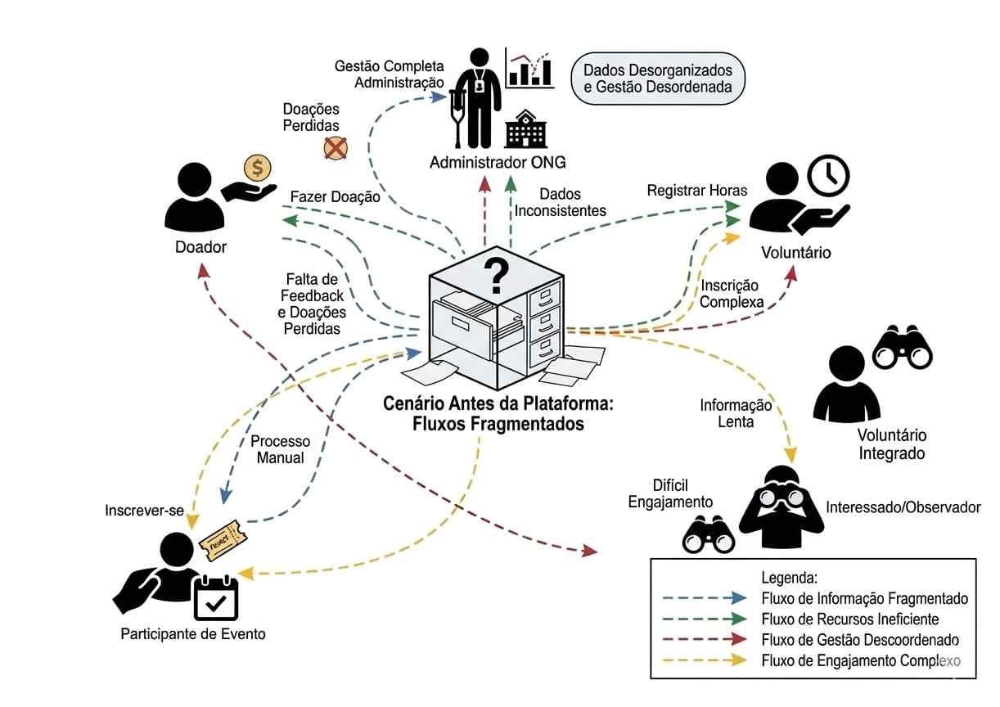
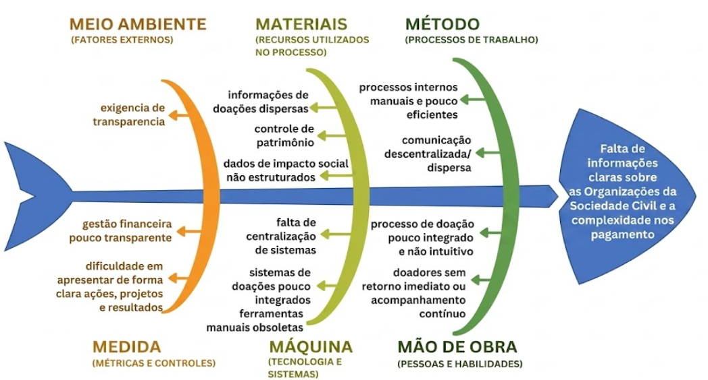

# 1. Cenário Atual do Cliente e do Negócio  

## 1.1 Identificação do Cliente/Parceiro  
* **Nome:** MoveEduca  
* **Tipo:** Organização da sociedade civil  
* **Representante:** Paulo Murilo Matielo de Oliveira  
* **Contato:** E-mail, WhatsApp, Discord e reuniões periódicas  
* **Vínculo:** Cliente e principal parte interessada  

## 1.2 Introdução ao Negócio e Contexto  
A MoveEduca é uma organização da sociedade civil, sem fins lucrativos, que atua principalmente no setor educacional, com foco na promoção do acesso à educação de qualidade, desenvolvimento social e fortalecimento da cidadania. Ela desenvolve projetos, eventos e iniciativas voltadas à educação, inclusão e desenvolvimento humano, atendendo principalmente populações em situação de vulnerabilidade. Sua atuação ocorre em parceria com diferentes setores da sociedade e é sustentada por doações, convênios e prestação de serviços.
Seu público-alvo é amplo e inclui estudantes, comunidades em situação de vulnerabilidade, voluntários, profissionais da educação, instituições públicas e privadas, além de doadores e parceiros interessados em promover impacto social. A organização também atua em colaboração com órgãos governamentais, instituições privadas e outras entidades da sociedade civil, buscando ampliar o alcance de suas iniciativas.
Criada com sede no Distrito Federal, a MoveEduca possui como missão central promover a educação, a inclusão e o desenvolvimento humano por meio de projetos e ações que contribuam para a transformação social. Para isso, a organização tem como objetivos realizar diversas atividades, como por exemplo, a promoção de cursos, palestras, seminários e eventos educacionais; o desenvolvimento e divulgação de pesquisas e conteúdos; a execução de projetos sociais e programas de capacitação; a prestação de serviços de consultoria e assessoria; além do incentivo ao voluntariado e à participação cidadã. Também atua em parceria com instituições públicas e privadas, promovendo intercâmbio de conhecimento, inclusão social e acesso à informação para diferentes públicos.
Apesar de sua relevância e diversidade de atuação, a MoveEduca enfrenta desafios relacionados à centralização de informações, transparência e visibilidade pública, o que reforça a necessidade de soluções digitais que apoiem sua gestão e ampliem seu impacto.

Seu público inclui:
* Estudantes  
* Comunidades vulneráveis  
* Voluntários  
* Profissionais da educação  
* Instituições públicas e privadas  
* Doadores e parceiros  

A MoveEduca atua em parceria com diversos setores da sociedade, buscando ampliar o alcance de suas iniciativas.

## 1.3 Rich Picture  
> Representação visual do cenário atual e da solução proposta.

## 1.4 Identificação do Problema  
Organizações da sociedade civil na atualidade enfrentam um problema central relacionado à ausência de uma plataforma digital unificada que permita que essa organização centralize suas operações. Essa falta de centralização dificulta que a população conheça, compreenda e se engaje com essas iniciativas, limitando o alcance das organizações e reduzindo seu potencial de captação de recursos e mobilização de voluntários. Nesse contexto, as ONGs se destacam como um dos principais exemplos de organizações da sociedade civil que sofrem com essa problemática 

Atualmente, muitas dessas organizações não possuem um ambiente único onde possam apresentar, de forma clara e acessível, suas ações, projetos e resultados. Informações importantes sobre a gestão de recursos dessas organizações acabam ficando dispersas ou pouco estruturadas, o que compromete a transparência e a confiança do público. Doadores e interessados encontram dificuldades para entender o impacto gerado e acompanhar como os recursos são utilizados ao longo do tempo.

Além disso, processos fundamentais, como a realização de doações, a comunicação com o público e o engajamento de voluntários, ocorrem de forma fragmentada. Dessa forma, a ausência de uma plataforma integrada torna o processo de doação menos intuitivo, dificulta a organização de eventos e limita a divulgação de informações institucionais, evidenciando a necessidade de uma solução centralizada que conecte todos esses elementos de forma eficiente e acessível.

## 1.5 Desafios do Projeto  
* Implementação de doações em tempo real  
* Garantia de consistência dos dados financeiros  
* Segurança e privacidade  
* Transparência e rastreabilidade  
* Boa usabilidade para múltiplos perfis  

## 1.6 Mapa de Stakeholders  

| Stakeholder | Relação | Interesse principal | Influência |
| :--- | :--- | :--- | :--- |
| **Paulo Murilo** | Representante | Validar requisitos | Alta |
| **Administradores** | Gestão interna | Controlar sistema | Alta |
| **Doadores** | Usuários externos | Transparência | Alta |
| **Voluntários** | Usuários ativos | Participação | Média |
| **Público geral** | Observadores | Conhecimento | Média |
| **Equipe dev** | Construtores | Entregar solução | Alta |
| **George Marsicano** | Avaliador Acadêmico | Qualidade técnica, cumprimento de prazos e critérios pedagógicos | Alta |

## 1.7 Segmentação de Clientes  
* **Administradores:** Gerenciam organizações.
* **Doadores:** Realizam contribuições.
* **Voluntários:** Participam de atividades.
* **Participantes:** Inscrevem-se em eventos.
* **Observadores:** Acompanham ações publicamente.